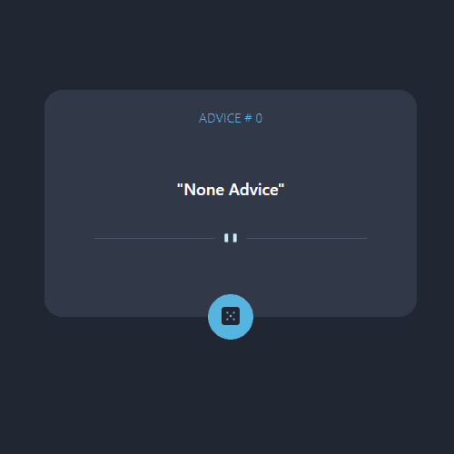

# Desafio Advice Generator do site frontendmentor.io


## Descrição:
App gerador de conselhos utilizando uma API\
<a href="https://femadvicegenerator.netlify.app/">Link do site</a>


## Indice
- <a href="#aprendizagens">Aprendizagens</a>
- <a href="#funcionalidades"> Funcionalidades </a>
- <a href="#tecnologias"> Tecnologias </a>
- <a href="#rodar"> Rodar </a>
- <a href="#colaboradores"> Colaboradores </a>
- <a href="#next"> Next </a>
- <a href="#contato"> Contatos </a>

## Aprendizagens
- [x] Integração de API.
- [x] Compreesão de requisição assíncrona.

## Funcionalidades
- [x] Gerador de conselhos

## Tecnologias
1. [React](https://pt-br.reactjs.org)
2. [Flexbox CSS](https://developer.mozilla.org/pt-BR/docs/Web/CSS/CSS_Flexible_Box_Layout/Basic_Concepts_of_Flexbox/)
3. [Typescript](https://www.typescriptlang.org/docs/)
4. [API](https://api.adviceslip.com/)


## Rodar
```bash
# Projeto inicializado com Create React App
# https://github.com/facebook/create-react-app

# Clone o repositório na pasta desejada
$ git clone https://github.com/vitorhub/advice-generator-app-main-type-redux.git

# Acesse a pasta do projeto no seu terminal
$ cd advice-generator-app-main-type-redux/

# Instale as dependencias
$ npm install

# Inicialize o projeto no navegador
$ npm start

# Para criar o arquivo de produção
$ npm run build

# A aplicação será acessada na porta 3000,
acesse pelo navegador: http://localhost:3000
```

## Colaboradores
Vitor Falcao\


## Next
- [ ] Botão gerador do advice não tem brilho lateral como consta no site.

## Contato
<a href="https://www.linkedin.com/in/vitorfalcaodesenvolvedor/"> Linkedin </a>
